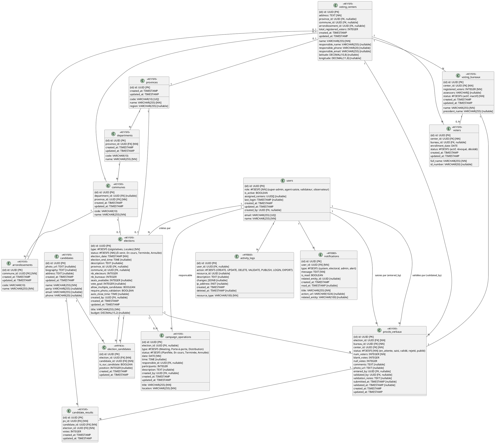

# 📊 STRUCTURE COMPLÈTE DE LA BASE DE DONNÉES - PROJET IKADI/o'Hitu-ResElec

## Version 1.0 - Modélisation UML Complète
**Date**: Octobre 2025
**Base de données**: PostgreSQL via Supabase
**Langage**: SQL

---

## 📋 TABLE DES MATIÈRES

1. [Vue d'ensemble du modèle](#vue-densemble-du-modèle)
2. [Schéma relationnel complet](#schéma-relationnel-complet)
3. [Description détaillée des tables](#description-détaillée-des-tables)
4. [Relations et cardinalités](#relations-et-cardinalités)
5. [Diagrammes UML (PlantUML/Mermaid)](#diagrammes-uml)
6. [Scripts SQL de création](#scripts-sql-de-création)
7. [Vues SQL (V-MODEL)](#vues-sql-v-model)
8. [Fonctions et Triggers](#fonctions-et-triggers)
9. [Row Level Security (RLS)](#row-level-security-rls)
10. [Index et Optimisations](#index-et-optimisations)

---

## VUE D'ENSEMBLE DU MODÈLE

### Domaines métier principaux

```
┌─────────────────────────────────────────────────────────────────┐
│                   SYSTÈME IKADI - DOMAINES                      │
├─────────────────────────────────────────────────────────────────┤
│                                                                 │
│  ┌──────────────────┐    ┌──────────────────┐                  │
│  │   AUTHENTIFICATION │    │   GESTION USER   │                 │
│  │   & SESSIONS      │    │   & RÔLES        │                 │
│  └──────────────────┘    └──────────────────┘                 │
│           │                        │                           │
│           └────────────┬───────────┘                           │
│                        ▼                                        │
│  ┌──────────────────────────────────────┐                      │
│  │      ADMINISTRATEURS ET ACTEURS      │                      │
│  │  (users, permissions, audit_logs)    │                      │
│  └──────────────────────────────────────┘                      │
│           │                                                    │
│           ├───────────────┬───────────────┬───────────────┐   │
│           ▼               ▼               ▼               ▼   │
│     ┌──────────┐   ┌──────────┐   ┌──────────┐   ┌──────────┐ │
│     │ ÉLECTIONS│   │INFRASTRUC│   │ CANDIDATS│   │ VOTANTS  │ │
│     │          │   │   TURE   │   │          │   │          │ │
│     └──────────┘   └──────────┘   └──────────┘   └──────────┘ │
│           │            │ │            │            │           │
│           └────┬───────┴─┴────────────┴────────────┘           │
│                ▼                                               │
│       ┌─────────────────────────────────┐                      │
│       │  RÉSULTATS & PROCÈS-VERBAUX     │                      │
│       │  (PV, candidate_results)        │                      │
│       └─────────────────────────────────┘                      │
│                ▼                                               │
│       ┌─────────────────────────────────┐                      │
│       │  NOTIFICATIONS & AUDIT          │                      │
│       │  (notifications, activity_logs) │                      │
│       └─────────────────────────────────┘                      │
└─────────────────────────────────────────────────────────────────┘
```

---

## SCHÉMA RELATIONNEL COMPLET

### Notation: 
- **PK**: Primary Key
- **FK**: Foreign Key
- **UQ**: Unique
- **NN**: Not Null
- **DEF**: Default value

```
╔════════════════════════════════════════════════════════════════════════════════════╗
║                      ENTITIES & ATTRIBUTS - DÉTAIL COMPLET                        ║
╚════════════════════════════════════════════════════════════════════════════════════╝

DOMAINE 1: AUTHENTIFICATION & GESTION D'ACCÈS
════════════════════════════════════════════════

┌─ users (Table Centrale)
│
│  Attributs:
│  ├─ id: UUID [PK] [Lié à auth.users Supabase]
│  ├─ email: VARCHAR(255) [UQ] [NN]
│  ├─ name: VARCHAR(255) [NN]
│  ├─ role: ENUM('super-admin', 'agent-saisie', 'validateur', 'observateur') [NN] [DEF: observateur]
│  ├─ is_active: BOOLEAN [NN] [DEF: true]
│  ├─ assigned_centers: UUID[] [optionnel] [Comment: array de center IDs pour roles limités]
│  ├─ last_login: TIMESTAMP WITH TIME ZONE [nullable]
│  ├─ created_at: TIMESTAMP WITH TIME ZONE [NN] [DEF: NOW()]
│  ├─ updated_at: TIMESTAMP WITH TIME ZONE [NN] [DEF: NOW()]
│  └─ created_by: UUID [FK → users.id] [nullable]
│
│  Contraintes:
│  ├─ PRIMARY KEY (id)
│  ├─ UNIQUE (email)
│  ├─ FOREIGN KEY (created_by) REFERENCES users(id) ON DELETE SET NULL
│  └─ CHECK (role IN ('super-admin', 'agent-saisie', 'validateur', 'observateur'))


DOMAINE 2: GÉOGRAPHIE ADMINISTRATIVE (HIÉRARCHIE TERRITORIALE)
═══════════════════════════════════════════════════════════════

┌─ provinces
│  ├─ id: UUID [PK]
│  ├─ code: VARCHAR(10) [UQ]
│  ├─ name: VARCHAR(255) [NN]
│  ├─ region: VARCHAR(255) [nullable]
│  ├─ created_at: TIMESTAMP [DEF: NOW()]
│  └─ updated_at: TIMESTAMP [DEF: NOW()]

├─ departments (optionnel: niveau intermédiaire)
│  ├─ id: UUID [PK]
│  ├─ province_id: UUID [FK → provinces.id] [NN]
│  ├─ code: VARCHAR(10)
│  ├─ name: VARCHAR(255) [NN]
│  ├─ created_at: TIMESTAMP [DEF: NOW()]
│  └─ updated_at: TIMESTAMP [DEF: NOW()]

├─ communes
│  ├─ id: UUID [PK]
│  ├─ department_id: UUID [FK → departments.id] [nullable]
│  ├─ province_id: UUID [FK → provinces.id] [NN]
│  ├─ code: VARCHAR(10)
│  ├─ name: VARCHAR(255) [NN]
│  ├─ created_at: TIMESTAMP [DEF: NOW()]
│  └─ updated_at: TIMESTAMP [DEF: NOW()]

└─ arrondissements
   ├─ id: UUID [PK]
   ├─ commune_id: UUID [FK → communes.id] [NN]
   ├─ code: VARCHAR(10)
   ├─ name: VARCHAR(255) [NN]
   ├─ created_at: TIMESTAMP [DEF: NOW()]
   └─ updated_at: TIMESTAMP [DEF: NOW()]

   Hiérarchie: Province → [Department →] Commune → Arrondissement


DOMAINE 3: ÉLECTIONS
═════════════════════

┌─ elections (Entité principale)
│
│  Attributs:
│  ├─ id: UUID [PK]
│  ├─ title: VARCHAR(255) [NN]
│  ├─ type: ENUM('Législatives', 'Locales') [NN]
│  ├─ status: ENUM('À venir', 'En cours', 'Terminée', 'Annulée') [NN] [DEF: 'À venir']
│  ├─ election_date: TIMESTAMP WITH TIME ZONE [NN]
│  ├─ election_end_time: TIME [nullable]
│  ├─ description: TEXT [nullable]
│  ├─ province_id: UUID [FK → provinces.id] [nullable]
│  ├─ department_id: UUID [FK → departments.id] [nullable]
│  ├─ commune_id: UUID [FK → communes.id] [nullable]
│  ├─ arrondissement_id: UUID [FK → arrondissements.id] [nullable]
│  ├─ nb_electeurs: INTEGER [DEF: 0]
│  ├─ nb_bureaux: INTEGER [DEF: 0]
│  ├─ seats_available: INTEGER [nullable]
│  ├─ budget: DECIMAL(15,2) [nullable]
│  ├─ vote_goal: INTEGER [nullable]
│  ├─ allow_multiple_candidates: BOOLEAN [DEF: false]
│  ├─ require_photo_validation: BOOLEAN [DEF: false]
│  ├─ auto_close_time: TIME [nullable]
│  ├─ created_by: UUID [FK → users.id] [nullable]
│  ├─ created_at: TIMESTAMP WITH TIME ZONE [NN] [DEF: NOW()]
│  └─ updated_at: TIMESTAMP WITH TIME ZONE [NN] [DEF: NOW()]
│
│  Contraintes:
│  ├─ PRIMARY KEY (id)
│  ├─ FOREIGN KEY (province_id) REFERENCES provinces(id) ON DELETE SET NULL
│  ├─ FOREIGN KEY (commune_id) REFERENCES communes(id) ON DELETE SET NULL
│  ├─ FOREIGN KEY (created_by) REFERENCES users(id) ON DELETE SET NULL
│  ├─ CHECK (nb_electeurs >= 0)
│  ├─ CHECK (nb_bureaux >= 0)
│  ├─ CHECK (seats_available > 0 OR seats_available IS NULL)
│  └─ CHECK (election_date >= NOW())


DOMAINE 4: INFRASTRUCTURE DE VOTE
═══════════════════════════════════

┌─ voting_centers (Centres de vote)
│
│  Attributs:
│  ├─ id: UUID [PK]
│  ├─ name: VARCHAR(255) [NN]
│  ├─ address: TEXT [NN]
│  ├─ province_id: UUID [FK → provinces.id] [nullable]
│  ├─ commune_id: UUID [FK → communes.id] [nullable]
│  ├─ arrondissement_id: UUID [FK → arrondissements.id] [nullable]
│  ├─ responsible_name: VARCHAR(255) [nullable]
│  ├─ responsible_phone: VARCHAR(20) [nullable]
│  ├─ responsible_email: VARCHAR(255) [nullable]
│  ├─ latitude: DECIMAL(10,8) [nullable]
│  ├─ longitude: DECIMAL(11,8) [nullable]
│  ├─ total_registered_voters: INTEGER [DEF: 0]
│  ├─ created_at: TIMESTAMP WITH TIME ZONE [NN] [DEF: NOW()]
│  └─ updated_at: TIMESTAMP WITH TIME ZONE [NN] [DEF: NOW()]
│
│  Contraintes:
│  ├─ PRIMARY KEY (id)
│  ├─ FOREIGN KEY (commune_id) REFERENCES communes(id) ON DELETE SET NULL
│  └─ CHECK (total_registered_voters >= 0)

└─ voting_bureaux (Bureaux de vote - Sous-unités des centres)

   Attributs:
   ├─ id: UUID [PK]
   ├─ center_id: UUID [FK → voting_centers.id] [NN]
   ├─ name: VARCHAR(255) [NN] [Comment: Bureau #1, #2, etc.]
   ├─ registered_voters: INTEGER [NN] [DEF: 0]
   ├─ president_name: VARCHAR(255) [nullable]
   ├─ assessors: VARCHAR[] [nullable] [Comment: array de noms assesseurs]
   ├─ status: ENUM('actif', 'inactif') [NN] [DEF: 'actif']
   ├─ created_at: TIMESTAMP WITH TIME ZONE [NN] [DEF: NOW()]
   └─ updated_at: TIMESTAMP WITH TIME ZONE [NN] [DEF: NOW()]

   Contraintes:
   ├─ PRIMARY KEY (id)
   ├─ FOREIGN KEY (center_id) REFERENCES voting_centers(id) ON DELETE CASCADE
   ├─ UNIQUE (center_id, name)
   └─ CHECK (registered_voters >= 0)


DOMAINE 5: CANDIDATS
═════════════════════

┌─ candidates (Candidats - Registre global)
│
│  Attributs:
│  ├─ id: UUID [PK]
│  ├─ name: VARCHAR(255) [NN]
│  ├─ party: VARCHAR(255) [nullable]
│  ├─ photo_url: TEXT [nullable] [Comment: Stockage Supabase]
│  ├─ biography: TEXT [nullable]
│  ├─ email: VARCHAR(255) [nullable]
│  ├─ phone: VARCHAR(20) [nullable]
│  ├─ address: TEXT [nullable]
│  ├─ created_at: TIMESTAMP WITH TIME ZONE [NN] [DEF: NOW()]
│  └─ updated_at: TIMESTAMP WITH TIME ZONE [NN] [DEF: NOW()]
│
│  Contraintes:
│  ├─ PRIMARY KEY (id)
│  └─ UNIQUE (name, party)

└─ election_candidates (Relation M:N - Candidats par élection)

   Attributs:
   ├─ id: UUID [PK]
   ├─ election_id: UUID [FK → elections.id] [NN]
   ├─ candidate_id: UUID [FK → candidates.id] [NN]
   ├─ is_our_candidate: BOOLEAN [NN] [DEF: false] [Comment: Flag prioritaire]
   ├─ position: INTEGER [nullable] [Comment: Ordre affichage]
   ├─ created_at: TIMESTAMP WITH TIME ZONE [NN] [DEF: NOW()]
   └─ updated_at: TIMESTAMP WITH TIME ZONE [NN] [DEF: NOW()]

   Contraintes:
   ├─ PRIMARY KEY (id)
   ├─ UNIQUE (election_id, candidate_id)
   ├─ FOREIGN KEY (election_id) REFERENCES elections(id) ON DELETE CASCADE
   └─ FOREIGN KEY (candidate_id) REFERENCES candidates(id) ON DELETE CASCADE


DOMAINE 6: VOTANTS/ÉLECTEURS
═════════════════════════════

└─ voters (Registre électoral)

   Attributs:
   ├─ id: UUID [PK]
   ├─ full_name: VARCHAR(255) [NN]
   ├─ id_number: VARCHAR(50) [nullable]
   ├─ center_id: UUID [FK → voting_centers.id] [NN]
   ├─ bureau_id: UUID [FK → voting_bureaux.id] [nullable]
   ├─ enrollment_date: DATE [NN] [DEF: TODAY()]
   ├─ status: ENUM('actif', 'révoqué', 'décédé') [NN] [DEF: 'actif']
   ├─ created_at: TIMESTAMP WITH TIME ZONE [NN] [DEF: NOW()]
   └─ updated_at: TIMESTAMP WITH TIME ZONE [NN] [DEF: NOW()]

   Contraintes:
   ├─ PRIMARY KEY (id)
   ├─ FOREIGN KEY (center_id) REFERENCES voting_centers(id) ON DELETE CASCADE
   ├─ FOREIGN KEY (bureau_id) REFERENCES voting_bureaux(id) ON DELETE SET NULL
   └─ UNIQUE (id_number, center_id) [WHERE status = 'actif']


DOMAINE 7: RÉSULTATS & PROCÈS-VERBAUX
═══════════════════════════════════════

┌─ procès_verbaux (Procès-verbaux)
│
│  Attributs:
│  ├─ id: UUID [PK]
│  ├─ election_id: UUID [FK → elections.id] [NN]
│  ├─ bureau_id: UUID [FK → voting_bureaux.id] [NN]
│  ├─ center_id: UUID [FK → voting_centers.id] [NN]
│  ├─ status: ENUM('en_attente', 'saisi', 'validé', 'rejeté', 'publié') [NN] [DEF: 'en_attente']
│  ├─ num_voters: INTEGER [NN]
│  ├─ blank_votes: INTEGER [DEF: 0]
│  ├─ null_votes: INTEGER [DEF: 0]
│  ├─ comments: TEXT [nullable]
│  ├─ photo_url: TEXT [nullable] [Comment: Stockage Supabase - PV papier]
│  ├─ entered_by: UUID [FK → users.id] [nullable]
│  ├─ validated_by: UUID [FK → users.id] [nullable]
│  ├─ validation_notes: TEXT [nullable]
│  ├─ submitted_at: TIMESTAMP WITH TIME ZONE [nullable]
│  ├─ validated_at: TIMESTAMP WITH TIME ZONE [nullable]
│  ├─ created_at: TIMESTAMP WITH TIME ZONE [NN] [DEF: NOW()]
│  └─ updated_at: TIMESTAMP WITH TIME ZONE [NN] [DEF: NOW()]
│
│  Contraintes:
│  ├─ PRIMARY KEY (id)
│  ├─ UNIQUE (election_id, bureau_id)
│  ├─ FOREIGN KEY (election_id) REFERENCES elections(id) ON DELETE CASCADE
│  ├─ FOREIGN KEY (bureau_id) REFERENCES voting_bureaux(id) ON DELETE CASCADE
│  ├─ FOREIGN KEY (center_id) REFERENCES voting_centers(id) ON DELETE CASCADE
│  ├─ FOREIGN KEY (entered_by) REFERENCES users(id) ON DELETE SET NULL
│  ├─ FOREIGN KEY (validated_by) REFERENCES users(id) ON DELETE SET NULL
│  ├─ CHECK (num_voters > 0)
│  └─ CHECK (status IN ('en_attente', 'saisi', 'validé', 'rejeté', 'publié'))

└─ candidate_results (Résultats détaillés par candidat)

   Attributs:
   ├─ id: UUID [PK]
   ├─ pv_id: UUID [FK → procès_verbaux.id] [NN]
   ├─ candidate_id: UUID [FK → candidates.id] [NN]
   ├─ election_id: UUID [FK → elections.id] [NN]
   ├─ votes: INTEGER [NN] [DEF: 0]
   ├─ created_at: TIMESTAMP WITH TIME ZONE [NN] [DEF: NOW()]
   └─ updated_at: TIMESTAMP WITH TIME ZONE [NN] [DEF: NOW()]

   Contraintes:
   ├─ PRIMARY KEY (id)
   ├─ UNIQUE (pv_id, candidate_id)
   ├─ FOREIGN KEY (pv_id) REFERENCES procès_verbaux(id) ON DELETE CASCADE
   ├─ FOREIGN KEY (candidate_id) REFERENCES candidates(id) ON DELETE CASCADE
   ├─ FOREIGN KEY (election_id) REFERENCES elections(id) ON DELETE CASCADE
   └─ CHECK (votes >= 0)


DOMAINE 8: AUDIT & NOTIFICATIONS
═════════════════════════════════

┌─ activity_logs (Audit trail complet)
│
│  Attributs:
│  ├─ id: UUID [PK]
│  ├─ user_id: UUID [FK → users.id] [nullable]
│  ├─ action: ENUM('CREATE', 'UPDATE', 'DELETE', 'VALIDATE', 'PUBLISH', 'LOGIN', 'EXPORT') [NN]
│  ├─ resource_type: VARCHAR(100) [NN] [Comment: election, pv, user, candidate, etc.]
│  ├─ resource_id: UUID [nullable]
│  ├─ description: TEXT [nullable]
│  ├─ changes: JSONB [nullable] [Comment: {old_values: {...}, new_values: {...}}]
│  ├─ ip_address: INET [nullable]
│  ├─ created_at: TIMESTAMP WITH TIME ZONE [NN] [DEF: NOW()]
│  └─ deleted_at: TIMESTAMP WITH TIME ZONE [nullable] [Comment: Pour soft deletes]
│
│  Contraintes:
│  ├─ PRIMARY KEY (id)
│  ├─ FOREIGN KEY (user_id) REFERENCES users(id) ON DELETE SET NULL
│  └─ CHECK (action IN ('CREATE', 'UPDATE', 'DELETE', 'VALIDATE', 'PUBLISH', 'LOGIN', 'EXPORT'))

└─ notifications (Notifications utilisateurs)

   Attributs:
   ├─ id: UUID [PK]
   ├─ user_id: UUID [FK → users.id] [NN]
   ├─ type: ENUM('system', 'electoral', 'admin', 'alert') [NN]
   ├─ title: VARCHAR(255) [NN]
   ├─ message: TEXT [NN]
   ├─ is_read: BOOLEAN [NN] [DEF: false]
   ├─ action_url: VARCHAR(1024) [nullable]
   ├─ related_entity: VARCHAR(100) [nullable] [Comment: Lien vers ressource]
   ├─ related_entity_id: UUID [nullable]
   ├─ created_at: TIMESTAMP WITH TIME ZONE [NN] [DEF: NOW()]
   └─ read_at: TIMESTAMP WITH TIME ZONE [nullable]

   Contraintes:
   ├─ PRIMARY KEY (id)
   ├─ FOREIGN KEY (user_id) REFERENCES users(id) ON DELETE CASCADE
   └─ CHECK (type IN ('system', 'electoral', 'admin', 'alert'))


DOMAINE 9: GESTION DE CAMPAGNE (Optionnel Phase 1)
════════════════════════════════════════════════════

└─ campaign_operations

   Attributs:
   ├─ id: UUID [PK]
   ├─ election_id: UUID [FK → elections.id] [nullable]
   ├─ title: VARCHAR(255) [NN]
   ├─ type: ENUM('Meeting', 'Porte-à-porte', 'Distribution') [NN]
   ├─ status: ENUM('Planifiée', 'En cours', 'Terminée', 'Annulée') [NN]
   ├─ date: DATE [NN]
   ├─ time: TIME [nullable]
   ├─ location: VARCHAR(255) [NN]
   ├─ responsible_id: UUID [FK → users.id] [nullable]
   ├─ participants: INTEGER [DEF: 0]
   ├─ description: TEXT [nullable]
   ├─ created_by: UUID [FK → users.id] [nullable]
   ├─ created_at: TIMESTAMP WITH TIME ZONE [NN] [DEF: NOW()]
   └─ updated_at: TIMESTAMP WITH TIME ZONE [NN] [DEF: NOW()]

   Contraintes:
   ├─ PRIMARY KEY (id)
   ├─ FOREIGN KEY (election_id) REFERENCES elections(id) ON DELETE SET NULL
   ├─ FOREIGN KEY (responsible_id) REFERENCES users(id) ON DELETE SET NULL
   └─ FOREIGN KEY (created_by) REFERENCES users(id) ON DELETE SET NULL
```

---

## RELATIONS ET CARDINALITÉS

### Matrice de relations avec cardinalités

```
╔════════════════════════════════════════════════════════════════════════════╗
║                    RELATIONS & CARDINALITÉS (CN)                          ║
╚════════════════════════════════════════════════════════════════════════════╝

1. users ─────────────► elections
   Created by         (1,N) : N utilisateurs créent N élections
   
2. elections ─────────► provinces
   (0,1)              : Une élection par province max (nullable)

3. elections ─────────► communes
   (0,1)              : Une élection par commune max (nullable)

4. provinces ─────────► departments
   (1,N)              : 1 province contient N departments

5. departments ────────► communes
   (1,N)              : 1 department contient N communes

6. communes ───────────► arrondissements
   (1,N)              : 1 commune contient N arrondissements

7. voting_centers ─────► provinces
   (0,1)              : Centre localisé en province (nullable)

8. voting_centers ─────► communes
   (0,1)              : Centre localisé en commune (nullable)

9. voting_centers ─────► arrondissements
   (0,1)              : Centre localisé en arrondissement (nullable)

10. voting_centers ────► voting_bureaux
    (1,N)             : 1 centre contient N bureaux
    Cascade on delete

11. elections ─────────► voting_centers
    (M,N)             : M élections utilisent N centres
    Junction table: election_centers (non définie ci-dessus, à ajouter)

12. candidates ────────► election_candidates
    (1,N)             : 1 candidat participe à N élections

13. elections ─────────► election_candidates
    (1,N)             : 1 élection a N candidats

14. voters ────────────► voting_centers
    (N,1)             : N votants inscrits 1 centre

15. voters ────────────► voting_bureaux
    (N,1)             : N votants inscrits 1 bureau (nullable)

16. elections ─────────► procès_verbaux
    (1,N)             : 1 élection génère N PV (1 par bureau)
    Cascade on delete

17. voting_bureaux ────► procès_verbaux
    (1,1)             : 1 bureau = 1 PV par élection
    Cascade on delete

18. procès_verbaux ────► candidate_results
    (1,N)             : 1 PV contient N résultats candidats
    Cascade on delete

19. candidates ────────► candidate_results
    (1,N)             : 1 candidat = N résultats (1 par PV)

20. users ─────────────► procès_verbaux (entered_by)
    (1,N)             : 1 agent saisit N PV

21. users ─────────────► procès_verbaux (validated_by)
    (1,N)             : 1 validateur valide N PV

22. users ─────────────► activity_logs
    (1,N)             : 1 utilisateur génère N logs

23. users ─────────────► notifications
    (1,N)             : 1 utilisateur reçoit N notifications

24. users ─────────────► campaign_operations (responsible)
    (1,N)             : 1 responsable organise N opérations

25. elections ─────────► campaign_operations
    (1,N)             : 1 élection a N opérations (nullable)

SYNOPSIS CARDINALITÉ:
├─ (0,1) = Optionnel, à 1
├─ (1,1) = Obligatoire, à 1
├─ (1,N) = 1 vers N
├─ (N,N) = Via junction table
└─ Cascade on delete: suppression parent → suppression enfants
```

---

## DIAGRAMMES UML (PlantUML/Mermaid)

### UML Complet - Diagramme de classes



### Diagramme Entité-Association (ER Diagram - Mermaid)

```mermaid
erDiagram
    USERS ||--o{ ELECTIONS : creates
    USERS ||--o{ PV : enters
    USERS ||--o{ PV : validates
    USERS ||--o{ ACTIVITY_LOGS : generates
    USERS ||--o{ NOTIFICATIONS : receives
    USERS ||--o{ CAMPAIGNS : manages
    
    PROVINCES ||--o{ DEPARTMENTS : contains
    DEPARTMENTS ||--o{ COMMUNES : contains
    COMMUNES ||--o{ ARRONDISSEMENTS : contains
    
    PROVINCES ||--o| ELECTIONS : "located in"
    COMMUNES ||--o| ELECTIONS : "located in"
    
    PROVINCES ||--o{ VOTING_CENTERS : "located in"
    COMMUNES ||--o{ VOTING_CENTERS : "located in"
    ARRONDISSEMENTS ||--o{ VOTING_CENTERS : "located in"
    
    VOTING_CENTERS ||--o{ VOTING_BUREAUX : contains
    VOTING_BUREAUX ||--|| PV : "generates (1 per election)"
    
    ELECTIONS ||--o{ PV : "generates"
    ELECTIONS ||--o{ ELECTION_CANDIDATES : includes
    CANDIDATES ||--o{ ELECTION_CANDIDATES : "participates in"
    CANDIDATES ||--o{ CANDIDATE_RESULTS : "has results"
    
    PV ||--o{ CANDIDATE_RESULTS : contains
    
    VOTING_CENTERS ||--o{ VOTERS : registers
    VOTING_BUREAUX ||--o{ VOTERS : registers
    
    ELECTIONS ||--o{ CAMPAIGNS : "has operations"

    USERS : UUID id
    USERS : string email
    USERS : string name
    USERS : enum role
    USERS : boolean is_active
    
    ELECTIONS : UUID id
    ELECTIONS : string title
    ELECTIONS : enum type
    ELECTIONS : enum status
    ELECTIONS : timestamp election_date
    
    PV : UUID id
    PV : UUID election_id
    PV : UUID bureau_id
    PV : enum status
    PV : integer num_voters
    
    CANDIDATES : UUID id
    CANDIDATES : string name
    CANDIDATES : string party
    
    VOTING_CENTERS : UUID id
    VOTING_CENTERS : string name
    VOTING_CENTERS : string address
    
    VOTING_BUREAUX : UUID id
    VOTING_BUREAUX : UUID center_id
    VOTING_BUREAUX : string name
    VOTING_BUREAUX : integer registered_voters
    
    VOTERS : UUID id
    VOTERS : string full_name
    VOTERS : UUID center_id
    
    CANDIDATE_RESULTS : UUID id
    CANDIDATE_RESULTS : UUID pv_id
    CANDIDATE_RESULTS : UUID candidate_id
    CANDIDATE_RESULTS : integer votes
```

---

## SCRIPTS SQL DE CRÉATION

### Script complet de migration

```sql
-- ============================================
-- IKADI / o'Hitu-ResElec - SCHEMA SQL COMPLET
-- ============================================

-- Activation des extensions
CREATE EXTENSION IF NOT EXISTS "uuid-ossp";
CREATE EXTENSION IF NOT EXISTS "postgis";

-- ============================================
-- 1. TABLES GÉOGRAPHIQUES
-- ============================================

CREATE TABLE provinces (
  id UUID PRIMARY KEY DEFAULT gen_random_uuid(),
  code VARCHAR(10) UNIQUE NOT NULL,
  name VARCHAR(255) NOT NULL,
  region VARCHAR(255),
  created_at TIMESTAMP WITH TIME ZONE DEFAULT NOW(),
  updated_at TIMESTAMP WITH TIME ZONE DEFAULT NOW(),
  CONSTRAINT provinces_code_not_empty CHECK (code != '')
);

CREATE TABLE departments (
  id UUID PRIMARY KEY DEFAULT gen_random_uuid(),
  province_id UUID NOT NULL REFERENCES provinces(id) ON DELETE CASCADE,
  code VARCHAR(10),
  name VARCHAR(255) NOT NULL,
  created_at TIMESTAMP WITH TIME ZONE DEFAULT NOW(),
  updated_at TIMESTAMP WITH TIME ZONE DEFAULT NOW(),
  CONSTRAINT departments_unique_code UNIQUE (province_id, code)
);

CREATE TABLE communes (
  id UUID PRIMARY KEY DEFAULT gen_random_uuid(),
  department_id UUID REFERENCES departments(id) ON DELETE SET NULL,
  province_id UUID NOT NULL REFERENCES provinces(id) ON DELETE CASCADE,
  code VARCHAR(10),
  name VARCHAR(255) NOT NULL,
  created_at TIMESTAMP WITH TIME ZONE DEFAULT NOW(),
  updated_at TIMESTAMP WITH TIME ZONE DEFAULT NOW(),
  CONSTRAINT communes_unique_code UNIQUE (province_id, code)
);

CREATE TABLE arrondissements (
  id UUID PRIMARY KEY DEFAULT gen_random_uuid(),
  commune_id UUID NOT NULL REFERENCES communes(id) ON DELETE CASCADE,
  code VARCHAR(10),
  name VARCHAR(255) NOT NULL,
  created_at TIMESTAMP WITH TIME ZONE DEFAULT NOW(),
  updated_at TIMESTAMP WITH TIME ZONE DEFAULT NOW(),
  CONSTRAINT arrondissements_unique_code UNIQUE (commune_id, code)
);

-- ============================================
-- 2. TABLE UTILISATEURS
-- ============================================

CREATE TABLE users (
  id UUID PRIMARY KEY,
  email VARCHAR(255) UNIQUE NOT NULL,
  name VARCHAR(255) NOT NULL,
  role VARCHAR(50) NOT NULL DEFAULT 'observateur'
    CHECK (role IN ('super-admin', 'agent-saisie', 'validateur', 'observateur')),
  is_active BOOLEAN NOT NULL DEFAULT true,
  assigned_centers UUID[] DEFAULT NULL,
  last_login TIMESTAMP WITH TIME ZONE,
  created_by UUID REFERENCES users(id) ON DELETE SET NULL,
  created_at TIMESTAMP WITH TIME ZONE DEFAULT NOW(),
  updated_at TIMESTAMP WITH TIME ZONE DEFAULT NOW(),
  CONSTRAINT user_email_format CHECK (email ~ '^[A-Za-z0-9._%+-]+@[A-Za-z0-9.-]+\.[A-Z|a-z]{2,}$')
);

-- ============================================
-- 3. TABLE ÉLECTIONS
-- ============================================

CREATE TABLE elections (
  id UUID PRIMARY KEY DEFAULT gen_random_uuid(),
  title VARCHAR(255) NOT NULL,
  type VARCHAR(50) NOT NULL CHECK (type IN ('Législatives', 'Locales')),
  status VARCHAR(50) NOT NULL DEFAULT 'À venir'
    CHECK (status IN ('À venir', 'En cours', 'Terminée', 'Annulée')),
  election_date TIMESTAMP WITH TIME ZONE NOT NULL,
  election_end_time TIME,
  description TEXT,
  province_id UUID REFERENCES provinces(id) ON DELETE SET NULL,
  department_id UUID REFERENCES departments(id) ON DELETE SET NULL,
  commune_id UUID REFERENCES communes(id) ON DELETE SET NULL,
  arrondissement_id UUID REFERENCES arrondissements(id) ON DELETE SET NULL,
  nb_electeurs INTEGER NOT NULL DEFAULT 0 CHECK (nb_electeurs >= 0),
  nb_bureaux INTEGER NOT NULL DEFAULT 0 CHECK (nb_bureaux >= 0),
  seats_available INTEGER CHECK (seats_available > 0 OR seats_available IS NULL),
  budget DECIMAL(15,2),
  vote_goal INTEGER,
  allow_multiple_candidates BOOLEAN DEFAULT false,
  require_photo_validation BOOLEAN DEFAULT false,
  auto_close_time TIME,
  created_by UUID REFERENCES users(id) ON DELETE SET NULL,
  created_at TIMESTAMP WITH TIME ZONE DEFAULT NOW(),
  updated_at TIMESTAMP WITH TIME ZONE DEFAULT NOW(),
  CONSTRAINT election_date_valid CHECK (election_date >= NOW() - INTERVAL '1 year')
);

-- ============================================
-- 4. INFRASTRUCTURE DE VOTE
-- ============================================

CREATE TABLE voting_centers (
  id UUID PRIMARY KEY DEFAULT gen_random_uuid(),
  name VARCHAR(255) NOT NULL,
  address TEXT NOT NULL,
  province_id UUID REFERENCES provinces(id) ON DELETE SET NULL,
  commune_id UUID REFERENCES communes(id) ON DELETE SET NULL,
  arrondissement_id UUID REFERENCES arrondissements(id) ON DELETE SET NULL,
  responsible_name VARCHAR(255),
  responsible_phone VARCHAR(20),
  responsible_email VARCHAR(255),
  latitude DECIMAL(10,8),
  longitude DECIMAL(11,8),
  total_registered_voters INTEGER NOT NULL DEFAULT 0 CHECK (total_registered_voters >= 0),
  created_at TIMESTAMP WITH TIME ZONE DEFAULT NOW(),
  updated_at TIMESTAMP WITH TIME ZONE DEFAULT NOW()
);

CREATE TABLE voting_bureaux (
  id UUID PRIMARY KEY DEFAULT gen_random_uuid(),
  center_id UUID NOT NULL REFERENCES voting_centers(id) ON DELETE CASCADE,
  name VARCHAR(255) NOT NULL,
  registered_voters INTEGER NOT NULL DEFAULT 0 CHECK (registered_voters >= 0),
  president_name VARCHAR(255),
  assessors VARCHAR[],
  status VARCHAR(50) NOT NULL DEFAULT 'actif' CHECK (status IN ('actif', 'inactif')),
  created_at TIMESTAMP WITH TIME ZONE DEFAULT NOW(),
  updated_at TIMESTAMP WITH TIME ZONE DEFAULT NOW(),
  CONSTRAINT unique_bureau_name UNIQUE (center_id, name)
);

-- ============================================
-- 5. CANDIDATS
-- ============================================

CREATE TABLE candidates (
  id UUID PRIMARY KEY DEFAULT gen_random_uuid(),
  name VARCHAR(255) NOT NULL,
  party VARCHAR(255),
  photo_url TEXT,
  biography TEXT,
  email VARCHAR(255),
  phone VARCHAR(20),
  address TEXT,
  created_at TIMESTAMP WITH TIME ZONE DEFAULT NOW(),
  updated_at TIMESTAMP WITH TIME ZONE DEFAULT NOW(),
  CONSTRAINT unique_candidate UNIQUE (name, party)
);

CREATE TABLE election_candidates (
  id UUID PRIMARY KEY DEFAULT gen_random_uuid(),
  election_id UUID NOT NULL REFERENCES elections(id) ON DELETE CASCADE,
  candidate_id UUID NOT NULL REFERENCES candidates(id) ON DELETE CASCADE,
  is_our_candidate BOOLEAN NOT NULL DEFAULT false,
  position INTEGER,
  created_at TIMESTAMP WITH TIME ZONE DEFAULT NOW(),
  updated_at TIMESTAMP WITH TIME ZONE DEFAULT NOW(),
  CONSTRAINT unique_election_candidate UNIQUE (election_id, candidate_id)
);

-- ============================================
-- 6. VOTANTS
-- ============================================

CREATE TABLE voters (
  id UUID PRIMARY KEY DEFAULT gen_random_uuid(),
  full_name VARCHAR(255) NOT NULL,
  id_number VARCHAR(50),
  center_id UUID NOT NULL REFERENCES voting_centers(id) ON DELETE CASCADE,
  bureau_id UUID REFERENCES voting_bureaux(id) ON DELETE SET NULL,
  enrollment_date DATE NOT NULL DEFAULT TODAY(),
  status VARCHAR(50) NOT NULL DEFAULT 'actif' CHECK (status IN ('actif', 'révoqué', 'décédé')),
  created_at TIMESTAMP WITH TIME ZONE DEFAULT NOW(),
  updated_at TIMESTAMP WITH TIME ZONE DEFAULT NOW(),
  CONSTRAINT unique_active_voter UNIQUE (id_number, center_id) WHERE (status = 'actif')
);

-- ============================================
-- 7. RÉSULTATS & PROCÈS-VERBAUX
-- ============================================

CREATE TABLE procès_verbaux (
  id UUID PRIMARY KEY DEFAULT gen_random_uuid(),
  election_id UUID NOT NULL REFERENCES elections(id) ON DELETE CASCADE,
  bureau_id UUID NOT NULL REFERENCES voting_bureaux(id) ON DELETE CASCADE,
  center_id UUID NOT NULL REFERENCES voting_centers(id) ON DELETE CASCADE,
  status VARCHAR(50) NOT NULL DEFAULT 'en_attente'
    CHECK (status IN ('en_attente', 'saisi', 'validé', 'rejeté', 'publié')),
  num_voters INTEGER NOT NULL CHECK (num_voters > 0),
  blank_votes INTEGER NOT NULL DEFAULT 0,
  null_votes INTEGER NOT NULL DEFAULT 0,
  comments TEXT,
  photo_url TEXT,
  entered_by UUID REFERENCES users(id) ON DELETE SET NULL,
  validated_by UUID REFERENCES users(id) ON DELETE SET NULL,
  validation_notes TEXT,
  submitted_at TIMESTAMP WITH TIME ZONE,
  validated_at TIMESTAMP WITH TIME ZONE,
  created_at TIMESTAMP WITH TIME ZONE DEFAULT NOW(),
  updated_at TIMESTAMP WITH TIME ZONE DEFAULT NOW(),
  CONSTRAINT unique_pv UNIQUE (election_id, bureau_id)
);

CREATE TABLE candidate_results (
  id UUID PRIMARY KEY DEFAULT gen_random_uuid(),
  pv_id UUID NOT NULL REFERENCES procès_verbaux(id) ON DELETE CASCADE,
  candidate_id UUID NOT NULL REFERENCES candidates(id) ON DELETE CASCADE,
  election_id UUID NOT NULL REFERENCES elections(id) ON DELETE CASCADE,
  votes INTEGER NOT NULL DEFAULT 0 CHECK (votes >= 0),
  created_at TIMESTAMP WITH TIME ZONE DEFAULT NOW(),
  updated_at TIMESTAMP WITH TIME ZONE DEFAULT NOW(),
  CONSTRAINT unique_pv_candidate UNIQUE (pv_id, candidate_id)
);

-- ============================================
-- 8. AUDIT & NOTIFICATIONS
-- ============================================

CREATE TABLE activity_logs (
  id UUID PRIMARY KEY DEFAULT gen_random_uuid(),
  user_id UUID REFERENCES users(id) ON DELETE SET NULL,
  action VARCHAR(50) NOT NULL
    CHECK (action IN ('CREATE', 'UPDATE', 'DELETE', 'VALIDATE', 'PUBLISH', 'LOGIN', 'EXPORT')),
  resource_type VARCHAR(100) NOT NULL,
  resource_id UUID,
  description TEXT,
  changes JSONB,
  ip_address INET,
  created_at TIMESTAMP WITH TIME ZONE DEFAULT NOW(),
  deleted_at TIMESTAMP WITH TIME ZONE
);

CREATE TABLE notifications (
  id UUID PRIMARY KEY DEFAULT gen_random_uuid(),
  user_id UUID NOT NULL REFERENCES users(id) ON DELETE CASCADE,
  type VARCHAR(50) NOT NULL CHECK (type IN ('system', 'electoral', 'admin', 'alert')),
  title VARCHAR(255) NOT NULL,
  message TEXT NOT NULL,
  is_read BOOLEAN NOT NULL DEFAULT false,
  action_url VARCHAR(1024),
  related_entity VARCHAR(100),
  related_entity_id UUID,
  created_at TIMESTAMP WITH TIME ZONE DEFAULT NOW(),
  read_at TIMESTAMP WITH TIME ZONE
);

-- ============================================
-- 9. CAMPAGNE
-- ============================================

CREATE TABLE campaign_operations (
  id UUID PRIMARY KEY DEFAULT gen_random_uuid(),
  election_id UUID REFERENCES elections(id) ON DELETE SET NULL,
  title VARCHAR(255) NOT NULL,
  type VARCHAR(50) NOT NULL CHECK (type IN ('Meeting', 'Porte-à-porte', 'Distribution')),
  status VARCHAR(50) NOT NULL CHECK (status IN ('Planifiée', 'En cours', 'Terminée', 'Annulée')),
  date DATE NOT NULL,
  time TIME,
  location VARCHAR(255) NOT NULL,
  responsible_id UUID REFERENCES users(id) ON DELETE SET NULL,
  participants INTEGER NOT NULL DEFAULT 0,
  description TEXT,
  created_by UUID REFERENCES users(id) ON DELETE SET NULL,
  created_at TIMESTAMP WITH TIME ZONE DEFAULT NOW(),
  updated_at TIMESTAMP WITH TIME ZONE DEFAULT NOW()
);

-- ============================================
-- 10. INDEX & OPTIMISATIONS
-- ============================================

-- Index sur elections
CREATE INDEX idx_elections_status ON elections(status);
CREATE INDEX idx_elections_date ON elections(election_date);
CREATE INDEX idx_elections_province ON elections(province_id);
CREATE INDEX idx_elections_created_by ON elections(created_by);

-- Index sur voting_centers
CREATE INDEX idx_voting_centers_commune ON voting_centers(commune_id);
CREATE INDEX idx_voting_centers_province ON voting_centers(province_id);

-- Index sur voters
CREATE INDEX idx_voters_center ON voters(center_id);
CREATE INDEX idx_voters_bureau ON voters(bureau_id);
CREATE INDEX idx_voters_fullname ON voters(full_name);
CREATE INDEX idx_voters_id_number ON voters(id_number);

-- Index sur procès_verbaux
CREATE INDEX idx_pv_election ON procès_verbaux(election_id);
CREATE INDEX idx_pv_bureau ON procès_verbaux(bureau_id);
CREATE INDEX idx_pv_status ON procès_verbaux(status);
CREATE INDEX idx_pv_entered_by ON procès_verbaux(entered_by);
CREATE INDEX idx_pv_validated_by ON procès_verbaux(validated_by);

-- Index sur candidate_results
CREATE INDEX idx_candidate_results_pv ON candidate_results(pv_id);
CREATE INDEX idx_candidate_results_election ON candidate_results(election_id);
CREATE INDEX idx_candidate_results_candidate ON candidate_results(candidate_id);

-- Index sur activity_logs
CREATE INDEX idx_activity_logs_user ON activity_logs(user_id);
CREATE INDEX idx_activity_logs_created_at ON activity_logs(created_at);

-- Index sur notifications
CREATE INDEX idx_notifications_user ON notifications(user_id);
CREATE INDEX idx_notifications_is_read ON notifications(is_read);

-- Full-text search index
CREATE INDEX idx_voters_fulltext ON voters 
  USING gin(to_tsvector('french', full_name));

CREATE INDEX idx_candidates_fulltext ON candidates 
  USING gin(to_tsvector('french', name || ' ' || COALESCE(party, '')));

-- ============================================
-- 11. TRIGGERS POUR AUDIT & MAJ AUTO
-- ============================================

-- Trigger pour mettre à jour updated_at
CREATE OR REPLACE FUNCTION update_updated_at_column()
RETURNS TRIGGER AS $$
BEGIN
  NEW.updated_at = NOW();
  RETURN NEW;
END;
$$ language 'plpgsql';

CREATE TRIGGER update_users_updated_at BEFORE UPDATE
  ON users FOR EACH ROW EXECUTE FUNCTION update_updated_at_column();

CREATE TRIGGER update_elections_updated_at BEFORE UPDATE
  ON elections FOR EACH ROW EXECUTE FUNCTION update_updated_at_column();

CREATE TRIGGER update_voting_centers_updated_at BEFORE UPDATE
  ON voting_centers FOR EACH ROW EXECUTE FUNCTION update_updated_at_column();

CREATE TRIGGER update_voters_updated_at BEFORE UPDATE
  ON voters FOR EACH ROW EXECUTE FUNCTION update_updated_at_column();

CREATE TRIGGER update_procès_verbaux_updated_at BEFORE UPDATE
  ON procès_verbaux FOR EACH ROW EXECUTE FUNCTION update_updated_at_column();

-- Trigger pour activity_logs (audit)
CREATE OR REPLACE FUNCTION log_activity()
RETURNS TRIGGER AS $$
BEGIN
  INSERT INTO activity_logs (user_id, action, resource_type, resource_id, changes)
  VALUES (
    current_setting('app.current_user_id')::uuid,
    TG_ARGV[0]::VARCHAR,
    TG_TABLE_NAME,
    COALESCE(NEW.id, OLD.id),
    jsonb_build_object('old', row_to_json(OLD), 'new', row_to_json(NEW))
  );
  RETURN COALESCE(NEW, OLD);
END;
$$ language 'plpgsql';

-- Application des triggers audit (optionnel, à adapter selon besoin)
-- CREATE TRIGGER audit_elections AFTER INSERT OR UPDATE OR DELETE ON elections
--   FOR EACH ROW EXECUTE FUNCTION log_activity('UPDATE');
```

---

## VUES SQL (V-MODEL)

```sql
-- ============================================
-- VUES POUR LES RAPPORTS & DASHBOARDS
-- ============================================

-- Vue: Résumé des élections
CREATE OR REPLACE VIEW election_summary AS
SELECT 
  e.id,
  e.title,
  e.type,
  e.status,
  e.election_date,
  e.province_id,
  p.name as province_name,
  COUNT(DISTINCT vc.id) as total_centers,
  COUNT(DISTINCT vb.id) as total_bureaux,
  COALESCE(SUM(vb.registered_voters), 0) as total_voters,
  COUNT(DISTINCT ec.candidate_id) as total_candidates,
  COUNT(DISTINCT pv.id) FILTER (WHERE pv.status = 'publié') as published_pvs,
  COUNT(DISTINCT pv.id) FILTER (WHERE pv.status = 'validé') as validated_pvs,
  COUNT(DISTINCT pv.id) FILTER (WHERE pv.status = 'saisi') as entered_pvs,
  COUNT(DISTINCT pv.id) FILTER (WHERE pv.status = 'rejeté') as rejected_pvs,
  COUNT(DISTINCT pv.id) FILTER (WHERE pv.status = 'en_attente') as pending_pvs
FROM elections e
LEFT JOIN provinces p ON e.province_id = p.id
LEFT JOIN election_centers ec ON e.id = ec.election_id
LEFT JOIN voting_centers vc ON ec.center_id = vc.id
LEFT JOIN voting_bureaux vb ON vc.id = vb.center_id
LEFT JOIN procès_verbaux pv ON e.id = pv.election_id
GROUP BY e.id, e.title, e.type, e.status, e.election_date, p.name, e.province_id;

-- Vue: Résultats consolidés par candidat
CREATE OR REPLACE VIEW candidate_election_results AS
SELECT 
  ec.election_id,
  e.title as election_title,
  ec.candidate_id,
  c.name as candidate_name,
  c.party,
  ec.is_our_candidate,
  COALESCE(SUM(cr.votes), 0) as total_votes,
  COUNT(DISTINCT cr.pv_id) as pv_count,
  ROUND(
    100.0 * COALESCE(SUM(cr.votes), 0) / 
    NULLIF((SELECT COALESCE(SUM(votes), 1) FROM candidate_results WHERE election_id = ec.election_id), 0),
    2
  ) as vote_percentage,
  ROW_NUMBER() OVER (PARTITION BY ec.election_id ORDER BY COALESCE(SUM(cr.votes), 0) DESC) as rank
FROM election_candidates ec
JOIN candidates c ON ec.candidate_id = c.id
JOIN elections e ON ec.election_id = e.id
LEFT JOIN candidate_results cr ON ec.candidate_id = cr.candidate_id AND ec.election_id = cr.election_id
GROUP BY ec.election_id, e.title, ec.candidate_id, c.name, c.party, ec.is_our_candidate;

-- Vue: Taux de saisie par bureau
CREATE OR REPLACE VIEW bureau_completion_rate AS
SELECT 
  e.id as election_id,
  e.title as election_title,
  vb.id as bureau_id,
  vb.name as bureau_name,
  vc.name as center_name,
  vb.registered_voters,
  CASE 
    WHEN pv.id IS NOT NULL THEN 'Complété'
    ELSE 'En attente'
  END as status,
  COALESCE(pv.num_voters, 0) as num_voters,
  pv.status as pv_status
FROM voting_bureaux vb
JOIN voting_centers vc ON vb.center_id = vc.id
CROSS JOIN elections e
LEFT JOIN procès_verbaux pv ON e.id = pv.election_id AND vb.id = pv.bureau_id
WHERE e.status IN ('En cours', 'Terminée')
ORDER BY e.election_date DESC, vc.name, vb.name;

-- Vue: Dashboard KPIs
CREATE OR REPLACE VIEW dashboard_stats AS
SELECT 
  COUNT(DISTINCT e.id) FILTER (WHERE e.status = 'En cours') as elections_en_cours,
  COUNT(DISTINCT e.id) FILTER (WHERE e.status = 'À venir') as elections_a_venir,
  COALESCE(SUM(vb.registered_voters), 0) as total_voters,
  COUNT(DISTINCT vc.id) as total_centers,
  COUNT(DISTINCT pv.id) FILTER (WHERE pv.status = 'en_attente') as pv_en_attente,
  COUNT(DISTINCT n.id) FILTER (WHERE n.is_read = false) as notifications_non_lues
FROM elections e
LEFT JOIN voting_centers vc ON TRUE
LEFT JOIN voting_bureaux vb ON vc.id = vb.center_id
LEFT JOIN procès_verbaux pv ON e.id = pv.election_id
LEFT JOIN notifications n ON TRUE;

-- Vue: Anomalies détectées
CREATE OR REPLACE VIEW detected_anomalies AS
SELECT 
  pv.id as pv_id,
  e.title as election_title,
  vb.name as bureau_name,
  vc.name as center_name,
  pv.num_voters,
  COALESCE(SUM(cr.votes), 0) + pv.blank_votes + pv.null_votes as total_votes,
  ABS(pv.num_voters - (COALESCE(SUM(cr.votes), 0) + pv.blank_votes + pv.null_votes)) as vote_discrepancy,
  pv.status,
  pv.comments,
  u.name as entered_by_name
FROM procès_verbaux pv
JOIN elections e ON pv.election_id = e.id
JOIN voting_bureaux vb ON pv.bureau_id = vb.id
JOIN voting_centers vc ON pv.center_id = vc.id
LEFT JOIN candidate_results cr ON pv.id = cr.pv_id
LEFT JOIN users u ON pv.entered_by = u.id
WHERE pv.status IN ('saisi', 'validé', 'rejeté')
GROUP BY pv.id, e.title, vb.name, vc.name, pv.num_voters, pv.blank_votes, pv.null_votes, pv.status, pv.comments, u.name
HAVING ABS(pv.num_voters - (COALESCE(SUM(cr.votes), 0) + pv.blank_votes + pv.null_votes)) > 0
ORDER BY vote_discrepancy DESC;
```

---

## FONCTIONS & TRIGGERS

```sql
-- ============================================
-- FONCTIONS MÉTIER
-- ============================================

-- Fonction: Calculer statistiques élection
CREATE OR REPLACE FUNCTION get_election_stats(election_uuid UUID)
RETURNS TABLE (
  total_centers BIGINT,
  total_bureaux BIGINT,
  total_voters BIGINT,
  pv_entered BIGINT,
  pv_validated BIGINT,
  pv_pending BIGINT
) AS $$
BEGIN
  RETURN QUERY
  SELECT 
    COUNT(DISTINCT vc.id)::BIGINT,
    COUNT(DISTINCT vb.id)::BIGINT,
    COALESCE(SUM(vb.registered_voters), 0)::BIGINT,
    COUNT(DISTINCT pv.id) FILTER (WHERE pv.status IN ('saisi', 'validé', 'publié'))::BIGINT,
    COUNT(DISTINCT pv.id) FILTER (WHERE pv.status = 'validé')::BIGINT,
    COUNT(DISTINCT pv.id) FILTER (WHERE pv.status = 'en_attente')::BIGINT
  FROM elections e
  LEFT JOIN voting_centers vc ON TRUE
  LEFT JOIN voting_bureaux vb ON vc.id = vb.center_id
  LEFT JOIN procès_verbaux pv ON e.id = pv.election_id
  WHERE e.id = election_uuid;
END;
$$ LANGUAGE plpgsql STABLE;

-- Fonction: Récupérer résultats candidat
CREATE OR REPLACE FUNCTION get_candidate_results(election_uuid UUID, candidate_uuid UUID)
RETURNS TABLE (
  candidate_name VARCHAR,
  total_votes BIGINT,
  percentage NUMERIC
) AS $$
BEGIN
  RETURN QUERY
  SELECT 
    c.name,
    COALESCE(SUM(cr.votes), 0)::BIGINT,
    ROUND(
      100.0 * COALESCE(SUM(cr.votes), 0) / 
      NULLIF((SELECT COALESCE(SUM(votes), 1) FROM candidate_results WHERE election_id = election_uuid), 0),
      2
    )::NUMERIC
  FROM candidates c
  LEFT JOIN candidate_results cr ON c.id = cr.candidate_id AND cr.election_id = election_uuid
  WHERE c.id = candidate_uuid
  GROUP BY c.id, c.name;
END;
$$ LANGUAGE plpgsql STABLE;

-- Fonction: Valider cohérence arithmétique PV
CREATE OR REPLACE FUNCTION validate_pv_arithmetic(pv_uuid UUID)
RETURNS TABLE (
  is_valid BOOLEAN,
  expected_total INTEGER,
  actual_total INTEGER,
  discrepancy INTEGER
) AS $$
DECLARE
  v_num_voters INTEGER;
  v_expected_total INTEGER;
  v_actual_total INTEGER;
BEGIN
  SELECT pv.num_voters INTO v_num_voters FROM procès_verbaux pv WHERE pv.id = pv_uuid;
  
  SELECT COALESCE(SUM(cr.votes), 0) + pv.blank_votes + pv.null_votes
  INTO v_actual_total
  FROM procès_verbaux pv
  LEFT JOIN candidate_results cr ON pv.id = cr.pv_id
  WHERE pv.id = pv_uuid
  GROUP BY pv.num_voters, pv.blank_votes, pv.null_votes;
  
  v_expected_total := v_num_voters;
  
  RETURN QUERY SELECT 
    (v_actual_total = v_expected_total)::BOOLEAN,
    v_expected_total,
    v_actual_total,
    ABS(v_actual_total - v_expected_total);
END;
$$ LANGUAGE plpgsql;
```

---

## ROW LEVEL SECURITY (RLS)

```sql
-- ============================================
-- POLITIQUES RBAC
-- ============================================

-- Activer RLS sur les tables sensibles
ALTER TABLE users ENABLE ROW LEVEL SECURITY;
ALTER TABLE elections ENABLE ROW LEVEL SECURITY;
ALTER TABLE procès_verbaux ENABLE ROW LEVEL SECURITY;
ALTER TABLE candidate_results ENABLE ROW LEVEL SECURITY;
ALTER TABLE activity_logs ENABLE ROW LEVEL SECURITY;
ALTER TABLE notifications ENABLE ROW LEVEL SECURITY;

-- Politique: Utilisateurs - Chacun voit son profil
CREATE POLICY "users_self_view" ON users
  FOR SELECT TO authenticated
  USING (
    id = auth.uid() 
    OR current_setting('role') = 'super-admin'
  );

-- Politique: Élections - Super-admin modifie, autres voient
CREATE POLICY "elections_read_all" ON elections
  FOR SELECT TO authenticated
  USING (true);

CREATE POLICY "elections_modify_admin_only" ON elections
  FOR INSERT, UPDATE, DELETE TO authenticated
  USING (
    current_setting('role') = 'super-admin'
    OR created_by = auth.uid()
  );

-- Politique: PV - Agents voient les leurs, validateurs tous
CREATE POLICY "pv_view_by_role" ON procès_verbaux
  FOR SELECT TO authenticated
  USING (
    current_setting('role') = 'super-admin'
    OR current_setting('role') = 'validateur'
    OR current_setting('role') = 'observateur'
    OR (current_setting('role') = 'agent-saisie' AND entered_by = auth.uid())
  );

CREATE POLICY "pv_insert_agents" ON procès_verbaux
  FOR INSERT TO authenticated
  WITH CHECK (
    current_setting('role') = 'super-admin'
    OR current_setting('role') = 'agent-saisie'
  );

-- Politique: Résultats candidats - Masqués avant publication
CREATE POLICY "candidate_results_published_only" ON candidate_results
  FOR SELECT TO authenticated
  USING (
    (SELECT status FROM procès_verbaux WHERE id = pv_id) = 'publié'
    OR current_setting('role') IN ('super-admin', 'validateur')
  );

-- Politique: Logs d'activité - Super-admin + traces propres actions
CREATE POLICY "activity_logs_restricted" ON activity_logs
  FOR SELECT TO authenticated
  USING (
    current_setting('role') = 'super-admin'
    OR user_id = auth.uid()
  );

-- Politique: Notifications - Chacun voit les siennes
CREATE POLICY "notifications_personal" ON notifications
  FOR SELECT TO authenticated
  USING (user_id = auth.uid());

CREATE POLICY "notifications_mark_read" ON notifications
  FOR UPDATE TO authenticated
  USING (user_id = auth.uid());
```

---

## INDEX ET OPTIMISATIONS

```sql
-- ============================================
-- STRATÉGIE D'INDEXATION COMPLÈTE
-- ============================================

-- Statistiques et analyse
ANALYZE;

-- Vérifier les index manquants
SELECT 
  schemaname,
  tablename,
  indexname,
  idx_scan,
  idx_tup_read,
  idx_tup_fetch
FROM pg_stat_user_indexes
ORDER BY idx_scan DESC;

-- Vérifier les queries lentes
SELECT 
  query,
  mean_exec_time,
  calls
FROM pg_stat_statements
WHERE mean_exec_time > 100
ORDER BY mean_exec_time DESC
LIMIT 10;

-- Maintenance périodique
VACUUM ANALYZE;
REINDEX DATABASE ikadi;

-- Monitoring table sizes
SELECT
  schemaname,
  tablename,
  pg_size_pretty(pg_total_relation_size(schemaname||'.'||tablename)) as size
FROM pg_tables
WHERE schemaname NOT IN ('pg_catalog', 'information_schema')
ORDER BY pg_total_relation_size(schemaname||'.'||tablename) DESC;
```

---

## RÉSUMÉ STATISTIQUES SCHÉMA

```
TABLES PRINCIPALES: 20
├─ Géographie: 4 tables (provinces, departments, communes, arrondissements)
├─ Utilisateurs: 1 table (users)
├─ Élections: 1 table (elections)
├─ Infrastructure: 2 tables (voting_centers, voting_bureaux)
├─ Candidats: 2 tables (candidates, election_candidates)
├─ Votants: 1 table (voters)
├─ Résultats: 2 tables (procès_verbaux, candidate_results)
├─ Audit: 2 tables (activity_logs, notifications)
└─ Campagne: 1 table (campaign_operations)

VUES: 5
├─ election_summary
├─ candidate_election_results
├─ bureau_completion_rate
├─ dashboard_stats
└─ detected_anomalies

FONCTIONS: 3
├─ get_election_stats(uuid)
├─ get_candidate_results(uuid, uuid)
└─ validate_pv_arithmetic(uuid)

INDEX: 25+
RLS POLICIES: 10+
RELATIONSHIPS: 25+
```

---

**Fin de la structure complète**

*Document référence pour création des diagrammes UML*
*Prêt pour implémentation en PostgreSQL/Supabase*
